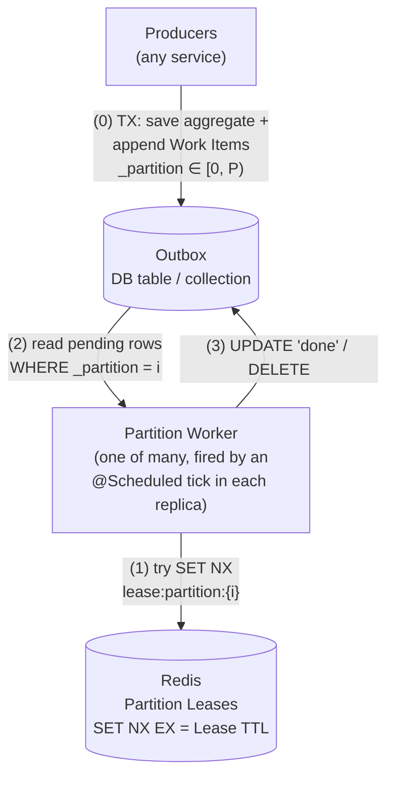
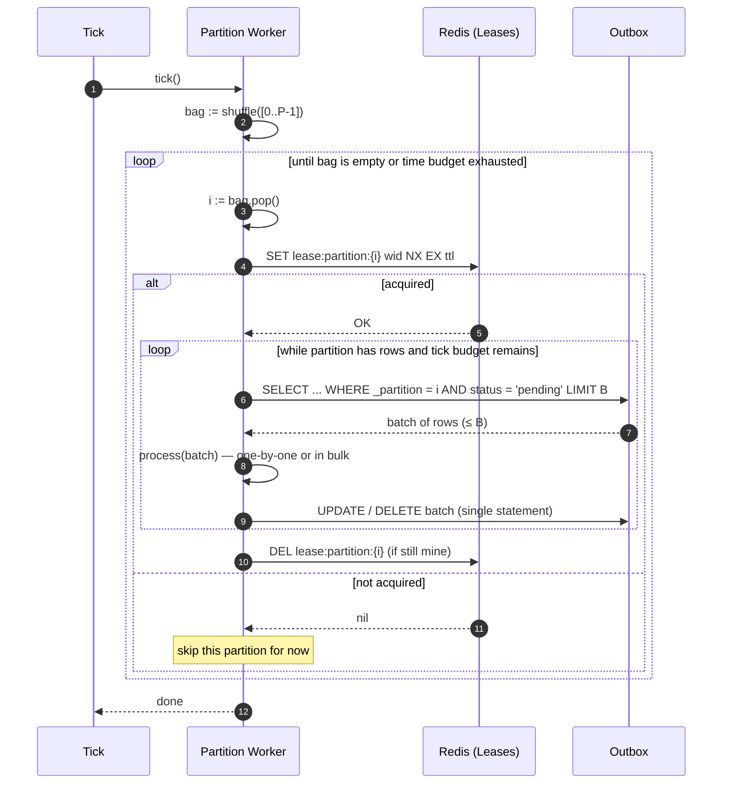
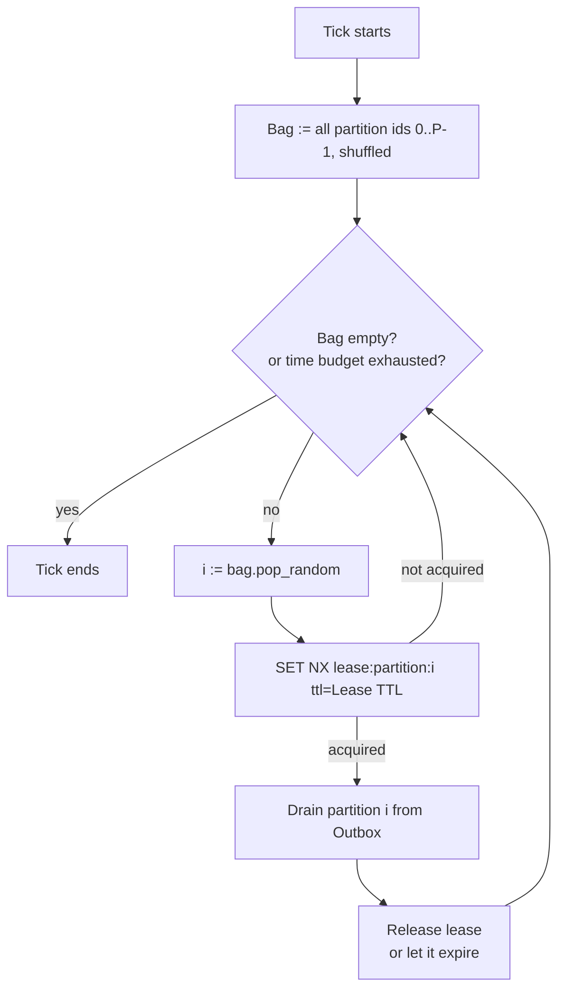

# Lease-Sharded Outbox: a coordinator-less pattern for concurrent background processing

A lightweight pattern for draining a backlog of "work intents" stored in a database — **one at a time or in batches** — with safe horizontal concurrency, no static thread-to-partition assignment, and no central coordinator.

## The problem

A service handles a business operation that updates an aggregate and, at the same time, must reliably trigger several side effects: notify other systems, recompute projections, send emails, reserve resources elsewhere. Those side effects are modelled as **domain events**.

The hard part is **atomicity of "aggregate + domain events"**. The aggregate change and its domain events have to be persisted together, or not at all. Pushing events directly to a message broker is not enough:

- If we publish to the broker *after* the DB commit, the broker push can fail and the events are silently lost.
- If we publish *before* the DB commit, the commit can fail and we end up announcing things that never happened.

This is what makes a plain queue / message broker insufficient on the producer side, and is the reason the **outbox pattern** exists: in the same write that saves the aggregate, we also persist its domain events into an **Outbox** table or collection. A separate process drains the Outbox afterwards and executes the side effects. Atomicity is guaranteed by the storage primitive itself:

- **SQL:** the aggregate write and the Outbox inserts share a single DB transaction.
- **MongoDB / document stores:** the domain events are embedded inside the aggregate document (as an `events: [...]` field), or written under a single document atomic write; a tailer/poller then promotes them to a dedicated Outbox view.

> This article assumes that precondition is met. It is **only** about the second half of the outbox pattern: how to drain the Outbox concurrently, safely, and elastically — without a coordinator.

What we want to nail down on the consumption side:

- The backlog is large enough that one worker is not enough.
- We want **N or more** worker threads (across one or several service instances) processing in parallel — never less than a configured minimum, more is fine.
- Each Work Item must be processed **exactly once at a time**: no two threads ever touch the same item concurrently.
- Workers must not coordinate with each other through the database (no row-level locks, no `SELECT … FOR UPDATE` contention).
- A crashed or hung worker must not block the system: its in-flight work must become processable again automatically.
- Adding or removing worker threads/instances must require zero reconfiguration. No re-balancing, no static assignment.
- **High-throughput friendly:** when the backlog is large, a Worker should be able to drain its slice in **batches** — a single query reading many rows, optionally a single bulk side effect, and a single bulk acknowledgement — instead of paying per-row overhead.

### A motivating example: order checkout

A customer places an order in an e-commerce backend. The service saves the `Order` aggregate (line items, totals, shipping address, etc.) and, in the **same transaction**, writes a handful of domain events into the Outbox:

- `OrderPlaced`
- `PaymentAuthorizationRequested`
- `InventoryReservationRequested`
- `OrderConfirmationEmailRequested`
- `SearchIndexUpdateRequested`

Each one becomes a Work Item in the Outbox. Later, a pool of workers drains them and runs the actual side effects: charging the payment gateway, reserving stock in the warehouse system, sending the confirmation email, refreshing the search index. The customer sees a fast checkout because none of those side effects block the response; the system stays consistent because nothing is published outside the DB until it is durably committed alongside the aggregate.

We will use this example throughout.

## Concepts

We will use these names consistently:

| Name                  | What it is                                                                                       |
|---                    |---                                                                                               |
| **Outbox**            | The table or collection where producers append domain events as Work Items.                      |
| **Work Item**         | A single row/document in the Outbox: a domain event with payload + bookkeeping fields.           |
| **Partition Key**     | A field on every Work Item, named `_partition`. An integer in `[0, P)`.                          |
| **Partition Count (P)** | Total number of partitions. Configurable. `P` is the **upper bound of effective concurrency**. |
| **Partition Worker**  | A thread (or process) that, on each tick, tries to grab one or more partitions and drain them. The pattern is master-less: each service replica runs its own ticker (e.g. a Spring `@Scheduled` method, a cron-style scheduler, a `setInterval`) and ticks its Partition Workers locally — there is no leader and no shared scheduler. |
| **Partition Lease**   | A short-lived exclusive claim on one partition, held in Redis as a `SET NX` key with TTL.        |
| **Lease TTL**         | Time-to-live of the lease. Sized as a multiple of the worst-case partition processing time.      |
| **Partition Bag**     | A per-tick local data structure used by a worker to randomly pick partitions without repetition. |

## Delivery semantics: at-least-once

The pattern delivers Work Items with **at-least-once** semantics. A Work Item is guaranteed to be processed *at least once*, and in pathological cases may be processed more than once. This is a direct consequence of the lease design:

- The Lease TTL is an upper bound on how long the system will wait for a presumed-dead Worker before letting another one claim its partition. If the original Worker is actually still alive but slow, two Workers may briefly drain the same partition concurrently.
- If a Worker successfully executes a Work Item's side effect but then crashes *before* it can mark the row as processed (or delete it), the next Worker will re-pick the same item from the Outbox and execute its side effect again.

Both cases are part of the contract, not bugs.

The mandatory consequence is that **the processing of every Work Item must be idempotent**. Concretely:

- The actual side effect (charging the gateway, sending the email, updating the index) must be safe to re-execute. Either it is intrinsically idempotent (e.g., upserting a projection by primary key), or it is made so via a deduplication key — the Work Item id is a natural one.
- The status transition that marks a Work Item as processed should be **conditional and atomic**, e.g. `UPDATE outbox SET status = 'done' WHERE id = ? AND status = 'pending'`, or a row delete guarded by id. This way two Workers cannot both succeed on the same row.

In exchange for the idempotency requirement, the pattern gives strong liveness: no Work Item ever stays stuck because of a crashed Worker, no partition becomes a SPOF, and no coordination is required.

## High-level architecture

Producers append Work Items (domain events) to the Outbox tagged with a `_partition` in `[0, P)`. Each service replica runs its own local ticker, which fires a fixed pool of Partition Workers. On each tick a Worker tries to acquire a Partition Lease in Redis for some partition, and — if it wins — drains the matching slice of the Outbox.



*Figure 1 — Conceptual architecture of the Lease-Sharded Outbox.*

The whole control plane fits in three things: a column on the Outbox, a Redis key per held partition, and a tick.

## How producers write

A producer saves the aggregate and appends one Work Item per domain event, all in the **same transaction**:

```sql
BEGIN;

INSERT INTO orders (id, customer_id, total, status, ...)
VALUES ('o-123', 'c-42', 199.90, 'placed', ...);

INSERT INTO outbox (id, type, payload, status, _partition, created_at) VALUES
  (uuid(), 'OrderPlaced',                    '{...}', 'pending', floor(random() * :P), now()),
  (uuid(), 'PaymentAuthorizationRequested',  '{...}', 'pending', floor(random() * :P), now()),
  (uuid(), 'InventoryReservationRequested',  '{...}', 'pending', floor(random() * :P), now()),
  (uuid(), 'OrderConfirmationEmailRequested','{...}', 'pending', floor(random() * :P), now()),
  (uuid(), 'SearchIndexUpdateRequested',     '{...}', 'pending', floor(random() * :P), now());

COMMIT;
```

That is the whole producer side. No coordination, no fan-out, no queue infrastructure. The atomicity story is entirely the database's job; the rest of the pattern only deals with how those rows get drained.

`_partition` is normally `floor(random() * P)`. If you want all events for the same order to land on the same partition (so they get processed by the same Worker, and incidentally in roughly insertion order), use `hash(order_id) mod P` instead — at the cost of skew if some orders are much heavier than others.

## How a Partition Worker runs

Each service replica has its own in-process scheduler (e.g. a Spring `@Scheduled` method, a `cron`-style ticker, a `setInterval`) that fires a **tick** every few seconds — typically 5 to 30. There is no master scheduler shared across replicas: every replica ticks on its own, completely independent from the others. A tick is *not* an infinite loop: a Worker performs a single pass and exits, then waits to be ticked again.

Within a single tick, a Worker:

1. Builds a fresh **Partition Bag** containing all integers `[0, P)`.
2. Picks a partition `i` uniformly at random from the Bag and removes it.
3. Tries to acquire the **Partition Lease** for `i` in Redis with `SET lease:partition:{i} <worker-id> NX EX <lease-ttl>`.
4. If `NX` failed (someone else holds it): go back to step 2.
5. If `NX` succeeded: drain partition `i` — read a **batch** of pending Work Items where `_partition = i` (typically `LIMIT B`, with `B` = *Batch Size*), process them — individually or as a bulk operation — and mark the whole batch processed (or delete it). Repeat the read/process/ack loop while the partition still has rows and there is time left in the tick.
6. After draining (or on error), release the lease (`DEL` if-still-mine via Lua/CAS) — or simply let it expire; both are safe.
7. If there is still time in the tick budget and the Bag is not empty, go back to step 2 to pick another partition. Otherwise, end the tick.



*Figure 2 — Lifecycle of a single Worker tick.*

Two important properties fall out of this loop:

- **Mutual exclusion per partition.** While a Worker holds the lease for partition `i`, no other Worker (in the same process, in another instance, on another host) can drain it. The Outbox table is read concurrently across *different* partitions, but never on the same partition.
- **No starvation.** Because partitions are drawn from the Bag without replacement and uniformly at random, every partition has a fair chance per tick, regardless of how many Workers are currently active.

## The Partition Bag, in detail

The Bag is a tiny, per-tick, in-memory structure that gives us *uniform without-replacement sampling* of partitions. It serves two goals:

- **Liveness:** if a Worker's first random pick collides with a held lease, it should not give up — it should try a different partition before the tick ends.
- **Fairness:** without the Bag, two competing Workers could keep colliding on the same hot partition by chance. Drawing without replacement guarantees that within a tick a Worker visits each partition at most once.



*Figure 3 — The Partition Bag algorithm.*

Note that **the Bag is per Worker per tick**: it is not shared across Workers. Coordination happens exclusively through Redis leases. The Bag is just a local scheduling trick.

## Why the lease TTL is the safety net

A Worker can crash, get OOM-killed, lose network, or just take longer than expected. We do not want a partition to become un-processable because of that.

The trick is sizing the **Lease TTL** as a multiple of the *expected worst-case time to drain a partition*:

```
Lease TTL = K * worst_case_drain_time      with K typically 2..4
```

Consequences:

- If the Worker finishes normally, it releases the lease explicitly and the partition becomes immediately available.
- If the Worker dies or hangs, the lease expires after `Lease TTL`, and the partition automatically becomes available to any Worker on the next tick.
- The TTL also caps the amount of time the system can spend "stuck" on a single bad Work Item, because the next tick will simply retry that partition.

There is one well-known caveat: if the actual processing exceeds the TTL, two Workers could end up processing the same partition concurrently (the original "owner" and a new "claimer"). Mitigations:

- Size `K` generously and make Work Item processing **idempotent** (which the outbox pattern already pushes you toward).
- Optionally, the Worker can periodically **refresh** its own lease while draining (e.g. `EXPIRE` if-still-mine via Lua).
- On release, only delete the key if it still holds the Worker's id (the `SET NX` value), to avoid releasing someone else's lease.

## Batch processing within a partition

A point worth emphasising: while a Worker holds the lease on partition `i`, it is the **sole reader** of that partition — by design. That exclusivity is what unlocks aggressive batching, which is often the difference between a pattern that survives at scale and one that does not.

A Worker draining a partition row-by-row would spend most of its tick on database round-trips and per-row overhead instead of useful work, and the `Lease TTL` would have to grow accordingly. The lease + sharding model removes the only thing that would normally prevent batching — concurrent contention on the same rows — so we can lean into it on three layers:

- **Batched reads.** Instead of fetching one Work Item at a time, the Worker reads up to `Batch Size` pending rows in a single query:

  ```sql
  SELECT id, type, payload
  FROM outbox
  WHERE _partition = :i AND status = 'pending'
  ORDER BY created_at
  LIMIT :B;
  ```

  The cost of opening a connection, parsing the query, and scanning the partition is amortised across `B` rows. Because no other Worker can touch this partition, there is no need for `FOR UPDATE SKIP LOCKED` or any row-level coordination — the partition lease *is* the coordination.

- **Batched processing.** When the side effect supports it (bulk HTTP endpoints, bulk indexing APIs, multi-row upserts on a projection, batched email sends), the Worker can execute the whole batch as a single operation rather than `B` sequential calls. This often turns a partition drain from `O(B)` external round-trips into `O(1)`. When the side effect does *not* support bulk, the Worker just iterates over the in-memory batch — still a win because the DB I/O has been collapsed.

- **Batched acknowledgement.** Marking the batch processed is a single statement:

  ```sql
  UPDATE outbox
  SET status = 'done', processed_at = now()
  WHERE id = ANY(:ids) AND status = 'pending';
  ```

  Atomic per row (the `status = 'pending'` guard preserves the at-least-once → idempotent contract from earlier), and one round-trip for the whole batch. Same idea for `DELETE`.

A typical drain therefore looks like this loop, repeated while the partition still has rows and there is tick budget left:

```
read up to B pending rows for partition i
  → process them (in bulk if possible)
  → ack the whole batch in one statement
```

This is not a separate "batch mode" of the pattern — it *is* the natural mode. The single-item case (`Batch Size = 1`) is just the degenerate case of the same loop, and the lease guarantees mutual exclusion either way.

Two caveats worth keeping in mind:

- **`Batch Size` interacts with `Lease TTL`.** Larger batches mean longer per-iteration processing. Make sure `Lease TTL` still covers the worst-case time to handle a full batch (or refresh the lease mid-drain — see the previous section).
- **Partial failure inside a batch is on the processor.** If processing item 7 of 100 fails, you decide whether to ack the first 6, leave the rest pending, and surface the error — or to roll the whole batch back. Both are fine; the lease + idempotency contract supports either policy.

## Configuration knobs

Everything that influences correctness or throughput is a single configurable parameter:

| Parameter             | What it controls                                                                          | Typical starting point     |
|---                    |---                                                                                        |---                         |
| **Partition Count P** | Maximum concurrent Workers that can do useful work. Granularity of contention.            | 8–32                       |
| **Tick Interval**     | How often the in-process scheduler wakes each Partition Worker.                           | 5–30 s                     |
| **Tick Time Budget**  | Max wall-clock a Worker spends per tick before exiting (so a stuck partition doesn't eat the tick). | 1–2 × Tick Interval |
| **Lease TTL**         | Safety window in case a Worker dies. Should cover worst-case drain time `× K`.            | `K = 2..4`                 |
| **Batch Size (B)**    | How many Work Items a Worker reads, processes, and acks per round inside a partition drain. Bigger = fewer DB round-trips, longer per-iteration time (mind the Lease TTL). | 50–500 |
| **Min Workers**       | Minimum number of Workers across the fleet. The system tolerates *more*, never *fewer*.   | `ceil(P/2)` or higher       |

## Sizing intuition

- **`P` is the ceiling on parallelism.** Increase `P` to allow more concurrency. A useful rule is `P ≈ 2..4 × peak_workers` so that even when half the partitions are being worked on, a fresh Worker still has a high chance of finding a free one in a few Bag draws.
- **More Workers than `P` is fine.** Excess Workers will just lose lease races and idle until the next tick. They cost nothing besides Redis NX traffic.
- **Producers should pick `_partition` uniformly** (e.g. plain `random() mod P`). Hashing by entity id is also fine if you want all Work Items for the same entity to be processed by the same Worker at the same time — at the cost of skew if some entities are much hotter than others.

## Failure modes and what protects us

| Failure                                | What happens                                                                  | Why it's safe                                                                 |
|---                                     |---                                                                            |---                                                                            |
| Worker crashes mid-drain               | Lease expires after `Lease TTL`; partition is re-leased on next tick.         | TTL on the Redis key.                                                         |
| Worker hangs longer than `Lease TTL`   | Another Worker may pick up the same partition.                                | Idempotent processors + atomic per-row status update / delete.                |
| Redis is briefly unavailable           | `SET NX` fails; Workers skip their tick.                                      | The Outbox is durable; nothing is lost. Backlog is drained on the next tick.  |
| One service replica dies               | Other replicas keep ticking; surviving Workers cover the missing partitions. | No static partition→Worker assignment; everything is dynamic per tick. Master-less by design. |
| Hot partition (skewed `_partition`)    | One partition takes longer; others drain quickly.                             | Backlog evens out over a few ticks. If chronic: increase `P`, fix producer's hash. |
| Producer crashes after writing         | Work Item sits in the Outbox until consumed; nothing else is needed.          | This is exactly what the outbox is for.                                       |

## Modifiability and scalability scenarios

### Scenario 1 — Increasing `P` (smooth)

We want more concurrency. We bump `P` from, say, 10 to 20 in the configuration of all services that touch the Outbox. Then:

1. **Bump the config.** `Partition Count = 20` in the shared config.
2. **Roll producers and consumers** (or wait for hot-reload). The order does not matter.
3. **Producers** that have picked up the new config start writing some Work Items with `_partition ∈ [10, 19]`. Old replicas keep using `[0, 9]`. Both are valid — they are just not yet uniformly distributed across `[0, 20)`.
4. **Consumers** that have picked up the new config build Bags over `[0, 20)`; old replicas still build Bags over `[0, 10)`. Both will happily lease and drain whichever partitions they pick. Partitions `[10, 19)` may have nothing in them for a brief window, in which case the Worker just acquires the lease, finds the partition empty, and moves on.
5. Once the rollout finishes, traffic is uniformly distributed across `[0, 20)` and effective concurrency has doubled.

No manual re-balancing, no coordination, no downtime. The pattern absorbs partial rollouts naturally.

### Scenario 2 — Decreasing `P` (not as smooth)

Going the other way needs more care, because we must not strand events in partitions that nobody will ever read again. Going from `P = 20` to `P = 10`:

1. **Reconfigure producers first**, lowering their `Partition Count` to 10. They stop writing into `[10, 19]`.
2. **Leave consumers configured at `P = 20`** for now. They keep building Bags over `[0, 20)` and fully drain the residual Work Items in partitions `[10, 19)`. No new ones are arriving in those, so they will eventually go to zero.
3. **Wait** until partitions `[10, 19)` are confirmed empty (a simple query: `SELECT COUNT(*) FROM outbox WHERE _partition >= 10 AND status = 'pending'`).
4. **Reconfigure consumers** to `P = 10`. From now on they only Bag-sample over `[0, 10)`.

> Optimization (mentioned, not deepened): during step 2 you can spin a small dedicated cluster of consumers that only sample the *retiring* partitions `[10, 19)`. They drain those faster while the main fleet keeps serving the active partitions normally. We will not go further into this here.

The asymmetry between the two scenarios is intrinsic: growing concurrency only ever adds new valid partitions, while shrinking must explicitly drain the partitions that are about to disappear before forgetting about them.

## Pros

- **Coordinator-less.** No leader election, no static assignment, no shard manager. Just a column, a Redis key, and a tick.
- **Elastic.** Add or remove Worker instances at any time; the next tick re-balances.
- **No SPOF.** Any Worker, on any instance, can drain any partition.
- **Cheap.** No queueing system, no message broker; the database you already have, plus a Redis you probably already have.
- **Easy to reason about.** Every guarantee maps to one of: the lease (mutex), the TTL (liveness), the Bag (fairness), the Partition Key (sharding).
- **Idempotency-friendly.** The model naturally pushes processors toward atomic per-item status transitions.
- **Batch-friendly by construction.** Because a Worker owns its partition exclusively for the duration of the lease, draining is not a row-by-row loop — it is a tight `read-batch / process-batch / ack-batch` cycle, with the option of bulk side effects when the downstream system supports them. No `FOR UPDATE SKIP LOCKED`, no per-row locking, no contention.

## Cons / things to watch

- **Requires Redis** (or any equivalent KV with `SET NX` + TTL). One more moving part — but exactly one.
- **Lease TTL ↔ processing time tension.** If `K` is too small, you risk concurrent processing of the same partition; too large, and recovery from a crashed Worker is slow. Idempotent processors make this a soft trade-off rather than a correctness one.
- **Changing `P` is asymmetric.** Increasing `P` is smooth and tolerates partial rollouts; decreasing `P` requires an explicit drain step (see *Modifiability and scalability scenarios*). It is a real operational consideration, not a one-line config change.
- **Hot-partition skew is on the producer.** Garbage in, garbage out: if `_partition` is not uniform, one Worker bears more load. Use a good hash or plain randomness.

## When this pattern is a good fit

- You can persist the aggregate and its domain events atomically (DB transaction in SQL; embedded events in Mongo). This is the precondition for an outbox in the first place.
- You have a database and a Redis already.
- Work Items are independent, or grouped only by some entity id used as the Partition Key.
- Latency requirements are "seconds", not "milliseconds".
- You want operational simplicity over a fully-fledged streaming / queueing platform.

Typical fits: dispatching domain events of an order/checkout aggregate, async webhooks, async projection / read-model rebuilds, recompute-on-write pipelines, periodic re-indexing of small slices, fan-out of "this happened, please react" notifications across internal subsystems.

## Related

- *Sharding a data repository to allow concurrent readers* — solves a related problem (concurrent readers over a shared repo) using a token queue and a Tokenizer component.
